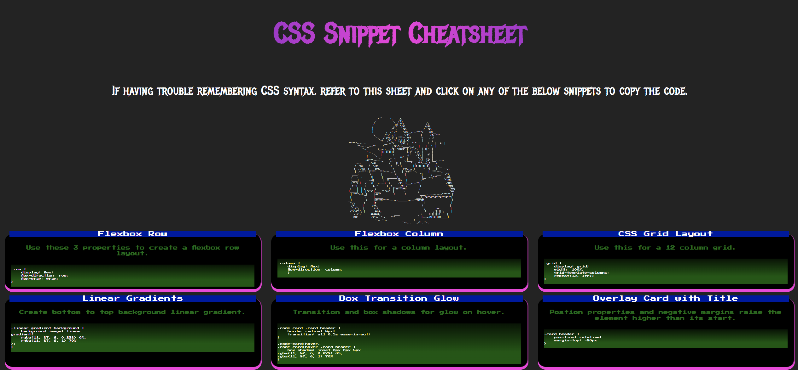

# CSS Cheatsheet

## Description

This is a short and future expandable cheat sheet displaying css code snippets for easy copying and reference for future projects. It acts as a handy reference to look back on for CSS tips, and quick copying of some common code snippets. It is easily expandable for more snippets to be added a my knowledge and skill set progress.

## Technologies Used

- HTML5
- CSS3
- Flexbox
- Google Fonts
- GitHub Pages

## Screenshot

## Live Demo

[GitHub Pages Link](https://rylanjp.github.io/css_cheatsheet/)

## Installation

- Use Git Bash to clone this project repository onto your local machine.  
- Once cloned onto your personal machine, navigate into the project directory. 
- Launch the project through your GitBash terminal using the "code ." command. 
- If you have any issues cloning the repository, refer to this GitHub doc on how to clone a repository. [Cloning-a-Repository](https://docs.github.com/en/repositories/creating-and-managing-repositories/cloning-a-repository).

## Usage

Clicking the code snippets on the cards will highlight them for easy copying to th user clipboard. This will allow easy and user friendly use in external code.

## Fonts

- [Metal Mania](https://fonts.google.com/specimen/Metal+Mania)

- [Press Start 2P](https://fonts.google.com/specimen/Press+Start+2P)

## Color Palette
 - primary-color: rgb(4, 4, 163);    Blue

 - secondary-color: rgb(3, 107, 15);  Green

 - dark-color: rgb(0, 0, 0);         Black

 - accent-color: rgb(249, 48, 222);   Pink

 - background-color: rgb(35, 35, 35); Grey

 - text-color: rgb(255, 255, 255);   White

## License

MIT License

Copyright (c) 2025 Rylan

Permission is hereby granted, free of charge, to any person obtaining a copy
of this software and associated documentation files (the "Software"), to deal
in the Software without restriction, including without limitation the rights
to use, copy, modify, merge, publish, distribute, sublicense, and/or sell
copies of the Software, and to permit persons to whom the Software is
furnished to do so, subject to the following conditions:

The above copyright notice and this permission notice shall be included in all
copies or substantial portions of the Software.

THE SOFTWARE IS PROVIDED "AS IS", WITHOUT WARRANTY OF ANY KIND, EXPRESS OR
IMPLIED, INCLUDING BUT NOT LIMITED TO THE WARRANTIES OF MERCHANTABILITY,
FITNESS FOR A PARTICULAR PURPOSE AND NONINFRINGEMENT. IN NO EVENT SHALL THE
AUTHORS OR COPYRIGHT HOLDERS BE LIABLE FOR ANY CLAIM, DAMAGES OR OTHER
LIABILITY, WHETHER IN AN ACTION OF CONTRACT, TORT OR OTHERWISE, ARISING FROM,
OUT OF OR IN CONNECTION WITH THE SOFTWARE OR THE USE OR OTHER DEALINGS IN THE
SOFTWARE.

## Badges

